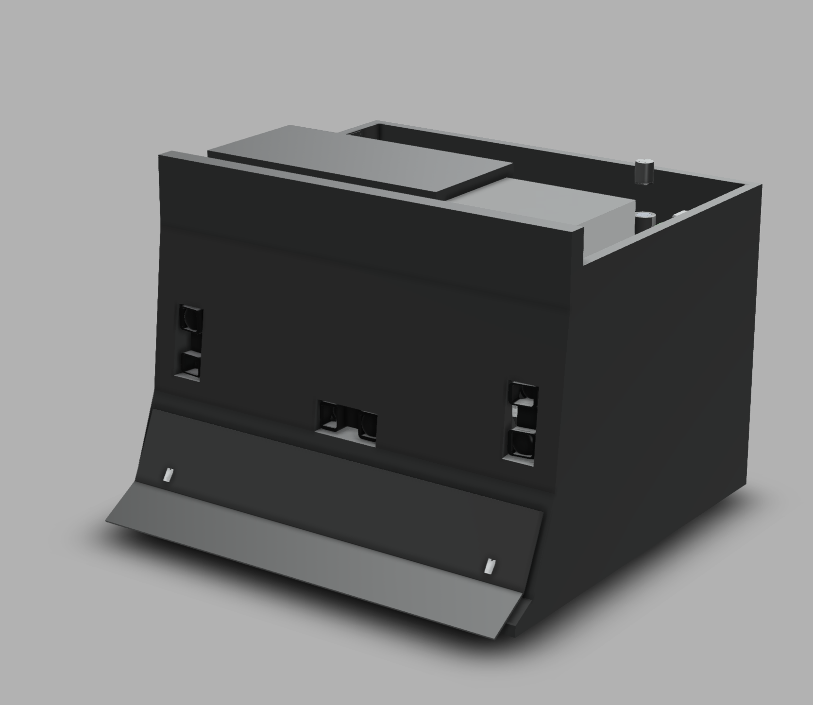
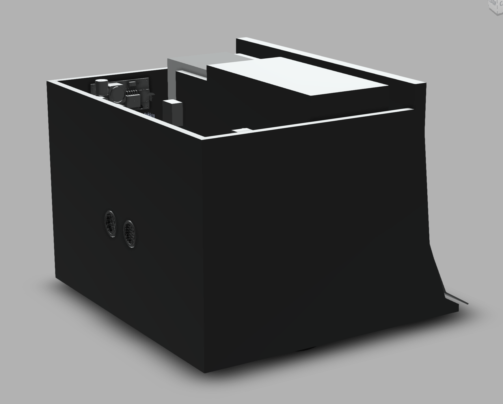
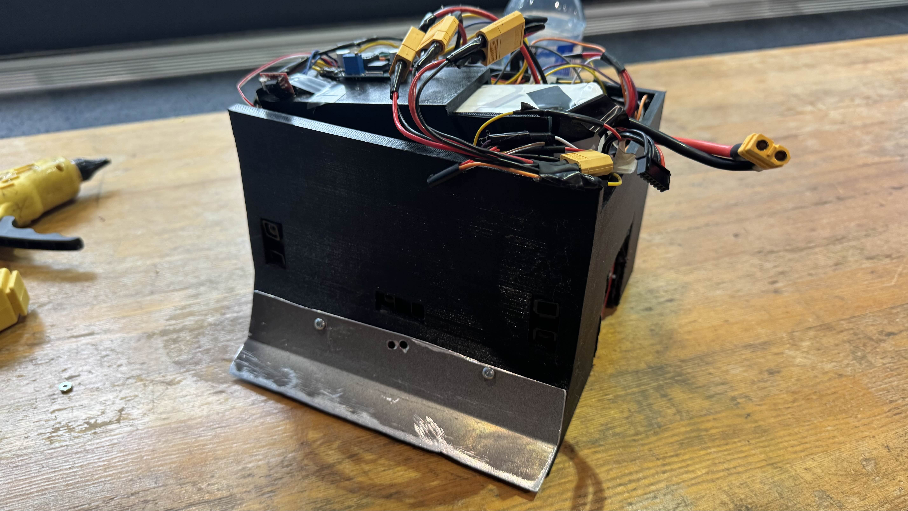

# Sumobot_404
The Driver for the sumo bot
A compact, low-latency Arduino-based sumo robot designed for competitive matches. Equipped with real-time edge detection, opponent tracking, and dual strategy modes for adaptive behavior in different match scenarios.

## 📌 Table of Contents
1. [Project Overview](#project-overview)  
2. [Features](#features)  
3. [Hardware Used](#hardware-used)  
4. [Software Architecture](#software-architecture)  
5. [How It Works](#how-it-works)  
6. [Setup & Installation](#setup--installation)  
7. [Usage](#usage)  
8. [Media](#media)  
9. [Challenges & Solutions](#challenges--solutions)  
10. [Future Improvements](#future-improvements)  
11. [Credits](#credits)

---

## 🧠 Project Overview

This project was built as part of a robotics course/competition. The goal was to create a powerful sumo robot capable of pushing opponents off the ring while avoiding boundaries. The robot is optimized for fast response and reliable decision-making using a state machine and low-level hardware control.

## Features

- Line-following avoidance using 4 edge sensors (Failed)
- Opponent detection using 3 IR distance sensors (Failed)
- Back-facing ultrasonic sensor for retreat detection
- State machine control for low-latency behavior

## Hardware Used

- Arduino Uno  
- 2 × 24V motors
- 4 × line sensors
- 3 × GP2Y0A02YK0F IR distance sensors  
- 1 × HC-SR04 ultrasonic sensor  
- 2 × bump switches  
- 2 x Motor driver BTS7960
- 22.2V LiPo battery (depending on motor specs)  
- Custom 3D printed chassis and metal blade

## 🧩 Software Architecture

- **SumoRobot.ino**: initializes all sensors and motors; runs core logic loop  
- **MotorTest.**: Driver used to test motor connection and rotation
- **SensorTest.ino**: Driver used to test all sensors 
- No floating point operations — all logic is integer-based  

## ⚙️ How It Works

**SumoRobot.ino**
1. Robot powers on
2. Sumo_Switch is pressed, Robot is activated.
3. Continuously checks for:
   - Opponent in front: move forward to push
   - No opponent: rotate to scan and reacquire target  
4.  Sumo_Switch is pressed again, Robot is deactivated.

## 🛠 Setup & Installation

1. Clone this repository  
2. Open `main.ino` in Arduino IDE  
3. Upload to Arduino Uno  
4. Connect sensors and motors according to the wiring diagram  
5. Power using external battery

## ▶️ Usage

1. Set the robot on the arena  
2. Press the strategy button to switch modes (LED indicator optional)  
3. Robot begins operation 5 seconds after power-on  
4. Automatically tracks and engages opponent while avoiding edges

## 🎥 Media

  
  
  

# Fusion file includes in folder

## 🧠 Challenges & Solutions

| Challenge                           | Solution                                      |
|-------------------------------------|-----------------------------------------------|
| Broken Line sensor and not enough space in the robot for Line sensors. | Remove the line sensors since no time for re-design. |
|-------------------------------------|-----------------------------------------------|
| IR sensors keep returning an incorrect Number. | Remove the IR sensors since no time for re-design.|

## 🚀 Future Improvements

- Redesign to fit line sensors.
- Improve IR sensors or replace IR sensors with other sensors.
- Upgrade to faster and smaller microcontroller (e.g., ESP32)

## 🙌 Credits

- [@Omiks](https://github.com/Omiks)
- [@ARandomNam](https://github.com/ARandomNam)
- [@brianhan8](https://github.com/brianhan8)
- [@jxa94](https://github.com/jxa94) 

---

